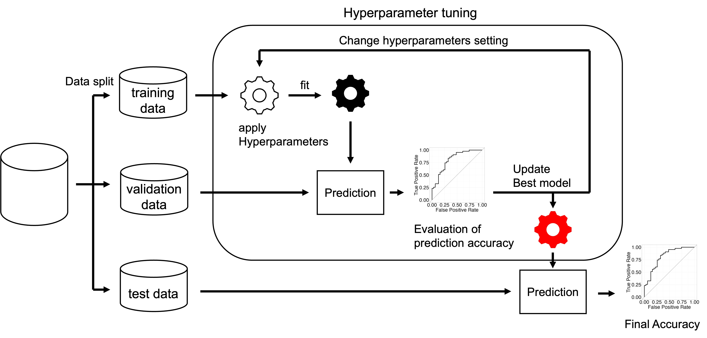

## 機械学習について
機械学習とは、大量のデータを読み込ませ、データ内に潜むパターンを学習させることで、未知のデータを判断するためのルールを獲得することを可能にするデータ解析技術である。  
機械学習の主要な目的は「予測」にある。機械学習の文脈での予測とは、データに含まれる変数同士の関係を抽出し、その関係を新しいデータに当てはめることで、特定の変数の値を推定することである。また、この予測は一般的な法則性を知ることとは異なる。特に、予測精度の高い機械学習手法の多くは、人間が解釈できるような知識を得られない「ブラックボックス」となっている。この点で、統計解析との大きな違いがある。<br>
<br>
※ 機械学習と混同される概念にAIとディープラーニング（深層学習）がある。AIとは人類の知能を再現する試み全般のことであり、機械学習とディープラーニングを内包する。ディープラーニングは、機械学習の一種の手法（多層ニューラルネットワーク）であり、これらは異なるものを示している。  
<br>
機械学習において「学習」の核となるのは、フィッティングの調整である。フィッティングは、仮説に基づく制約によりモデルを作るのではなく、データに合わせて自由にモデルを作っていく過程に近い。そのため、どこまでデータに合わせるかが重要となる。（過学習・学習不足）  
機械学習で使われるアルゴリズムは、分析者がハイパーパラメータを指定する必要がある。通常のパラメータはモデルの形を制御する一方で、ハイパーパラメータはパラメータを決めるための条件を調整する。（4. チューニングへ）  
<br>

## 機械学習のステップ
<br>
### 1. データ分割（split）
データの一部を評価用、残りを学習（フィッティング）用に分ける。これは、新しいデータに対しても適切な予測結果が得られること（汎化性能）を重視するため行われる。
データの分割は主に2回行われ、最初の分割では最終的な精度を試すテストデータを取り出す。次の分割では、データに対する最適なハイパーパラメータに調整するために学習用のデータ（トレーニングデータ）と調整具合を確かめる（検証用データ）に分割する。  
以下、分割の手法である。
* ホールドアウト法  
サンプル数が多い時に行われる。データを任意の割合で分割し、テストデータと検証用データにする。  
* ランダムサンプリング  
ランダムにデータを抽出して訓練データセットを構築し、抽出されなかったサンプルをテストに使用する。データセットの構築とテストを複数回行い、全試行の平均を最終的な評価結果として採用する。  
* クロスバリデーション（交差検証）法  
何度か異なる分割を行い、学習データと検証データの異なる組み合わせを得る方法。全てのデータがテストに使用される点でランダムサンプリングと異なる。  
分割数をkで示し、k層分割交差検証（k-folds cross validation）と呼ぶ。  
<br>
以下のサンプルコードでは、テストデータはホールドアウト法で分割し、チューニングはクロスバリデーションで行っている。

### 2. 学習
機械学習の利用方法は、教師あり学習と教師なし学習に大別される。  
教師あり学習は**回帰**と**分類**に分かれる。  
教師なし学習は**クラスタリング**と**次元削減**に分かれる。
学習のステップでは、アルゴリズムの選択・説明変数と目的変数の選択・ハイパーパラメータの設定を行う必要がある。  
**以下は分類問題アルゴリズムのみの紹介である**

#### 正則化線形回帰
* ElasticNet (Ridge, Lasso)  
さまざまな線形回帰モデルと組み合わせることで、モデルをなめらかにしたり、影響の小さい変数を減らすことができる。  
[glmnet](https://glmnet.stanford.edu/articles/glmnet.html)   

* group Elastic Net (LASSO)  
グループごとに変数を減らせる 
[grpnet](https://cran.r-project.org/web/packages/grpnet/index.html)

#### 境界分類
* SVM（Support Vector Machine）  
空間に境界を作ることでデータを分類する。  
非線形な分類も可能である。  
[サンプルコード](https://colab.research.google.com/drive/17iVNlxBAO6eKqJaew8-H_nviWbNDsjpJ?usp=sharing)

#### 決定木ベース
* 決定木  
一番基礎的な決定木モデル。木に似たフローを作ることで分類する。  
[サンプルコード](https://colab.research.google.com/drive/165NfKJRO89UMDwl5yMOAeD6wuZcFqA16?usp=sharing)
* ランダムフォレスト  
たくさんの木を作り、それらの多数決を行うことで分類する。  
[サンプルコード](https://colab.research.google.com/drive/1cNyNKNs5jaCD0RnGgvYfBfhqn8jy56Xh?usp=sharing)
* LightGBM  
段階ごとに木を深くして行く。前の段階で精度の良くないノードから枝を生やすことで精度を上げて行く。
* XGBoost  
段階ごとに木を深くして行く。前までの木でうまく分類できなかった箇所を埋めるように次の木を作って行く。  
[サンプルコード](https://colab.research.google.com/drive/1NdQntsLuqOBJVFjngdVUWqZn1-MUszuz?usp=sharing)

#### 🚧ニューラルネットワーク🚧
* 基本的なニューラルネットワーク  
[サンプルコード](https://colab.research.google.com/drive/1ouVsJgs3CIpDOj_0mZ_rToG5E9ypd0kV?usp=sharing)
<<Note(ニューラルネットワークのサンプルコードではGPUを用いています。  
普段より利用できる時間・計算量に制限があるので注意して使ってください。)>>
* 畳み込みニューラルネットワーク（CNN）  
* 再起型ニューラルネットワーク（RNN）  


### 3. 評価
学習に用いていないデータによりモデルの予測精度を確認する。  

#### 分類問題  
分類問題では、混同行列を作成してから様々な指標を確認する。  
|                | Predicted Positive | Predicted Negative |
|----------------|--------------------|--------------------|
| **Actual Positive** | TP (True Positive)                 | FN (False Negative)                 |
| **Actual Negative** | FP (False Positive)                  | TN (True Negative)                 |

* 正解率  
全ての予測のうち、正解した予測の割合  
TP + TN / TP + TN + FP + FN
* 適合率  
陽性と予測したもののうち、実際に陽性であるものの割合
TP / TP + FP
* 再現率  
実際に陽性であるもののうち、正しく陽性と予測できたものの割合
TP / TP + FN
* F値  
適合率と再現率の調和平均
2 × 適合率 × 再現率 / 適合率 + 再現率
* AUC-ROC  
サンプルを正しく並び替えることができたかを示す  
[参考](https://arize.com/blog/what-is-auc/)
* AUC-PR  
不均衡データの際に用いられる。ランキングが上位のサンプルの予測の正確さをより重視する。

#### 回帰問題
* 平均二乗誤差（MSE）  
* 平均絶対誤差（MAE）  
* 平均絶対誤差率（MAPE）  

### 4. チューニング
高い予測精度を得るために学習の際のハイパーパラメータの値を変えて、学習と検証データによる評価を繰り返す。
* グリッドサーチ  
与えられたハイパーパラメータの候補の値の全パターンのモデル構築を行う手法である。  

```
param_grid = {
    "X": ["A",  "B"], 
    "Y": [i / 10 for i in range(10, 20, 2)],  # out -> [1.0, 1.2, 1.4, 1.6, 1.8, 2.0]
}
```

上記の場合、2 * 10 の20パターンでモデルが構築され、最も精度の高いパラメータが選ばれる。

* ランダムサーチ  
グリッドサーチでは網羅的に組み合わせを探索するため、モデルを緻密に調整しようと思うと膨大な時間がかかってしまう。  
ランダムサーチは、指定されたハイパーパラメータの範囲内でランダムに値を選択し、その組み合わせに基づいてモデルの性能を評価する。  
ランダムな組み合わせを選択するため、局所最適に陥らず、短時間で良好な組み合わせを見つけられる可能性がある。

* ベイズ最適化  
ベイズ最適化では、ランダム性に頼らず、最小限の試行で最適な解を見つけることを目指す。
未知の目的関数をモデル化するために確率モデル（例えばガウス過程）を使用し、このモデルの上で事後分布を更新することによって、次の試行点を選択する。  
**サンプルコードにはoptunaでベイズ最適化を実装している。**

### 🚧不均衡データ🚧


## About Machine Learning
Machine learning is a data analysis technique that enables the acquisition of rules for making decisions about unknown data by reading large amounts of data and learning patterns latent in the data.  
The primary goal of machine learning is "Prediction". Prediction in the context of machine learning is to estimate the value of a particular variable by extracting the relationship between variables in the data and applying that relationship to new data. This "prediction" is also different from knowing the general rule of thumb. In particular, many machine learning methods with high prediction accuracy are “black boxes” that do not yield knowledge that can be interpreted by humans. In this respect, there is a major difference between statistical analysis. 
<br><br>
※ AI and deep learning are concepts that are confused with machine learning. AI refers to any attempt to reproduce human intelligence, and includes machine learning and deep learning. Deep learning is a type of machine learning technique (multilayer neural network), and these refer to different things.
<br><br>
The core of "learning" in machine learning is fitting adjustment. Fitting is more like the process of freely creating a model to fit the data, rather than creating a model with constraints based on a hypothesis. Therefore, the extent to which it fits the data is important. (Overfitting, Underfitting)
<br><br>
Algorithms used in machine learning require analysts to specify hyperparameters. While regular parameters control the shape of the model, hyperparameters adjust the conditions for determining the parameters. (Continue to 4. Tuning)
<br><br>

## Steps of Machine Learning
<br>
### 1. Data Split
A portion of the data is divided for evaluation and the remainder for training (fitting). This is done to emphasize the importance of obtaining appropriate prediction results even for new data (generalization performance).
The data is split twice, the first split being the test data for the final accuracy. In the next split, the data is split into training data and validation data in order to adjust the hyperparameters to the best fit for the data.  
The following is the method of division.  
* Hold-out method  
This is done when the number of samples is large. Data is splot into test data and data for verification at an arbitrary ratio.  
* Random sampling  
Randomly extract data to construct a training data set, and use the unextracted samples for testing. Construct and test the dataset multiple times, and adopt the average of all trials as the final evaluation result.  
* Cross-validation method  
A method of obtaining different combinations of training and validation data by making several different splits. It differs from random sampling in that all data are used for testing.  
The number of splits is denoted by k and is called k-folds cross validation (k-folds cross validation).  
<br>
In the sample code below, test data is split using the holdout method and tuning is done by cross validation.

### 2. Machine Learning Methods (algorithms)
The algorithms of machine learning can be broadly divided into supervised and unsupervised learning.  
Supervised learning is divided into **regression** and **classification**.  
Unsupervised learning is divided into **clustering** and **dimension reduction**.
In this step, it is necessary to select the algorithm, the explanatory and objective variables, and the hyperparameters.  
**The following is an introduction to the classification problem algorithms only**.

#### Regularized linear regression
* ElasticNet (Ridge, Lasso)  
Combined with various linear regression models, the model can be smoothed or reduced to variables with small effects.  
[glmnet](https://glmnet.stanford.edu/articles/glmnet.html)   

* group Elastic Net (LASSO)  
Can reduce variables per group  
[grpnet](https://cran.r-project.org/web/packages/grpnet/index.html)

#### Boundary classification
* SVM（Support Vector Machine）  
Classifies data by creating boundaries in space.  
Non-linear classification is also possible.  
[Sample code](https://colab.research.google.com/drive/17iVNlxBAO6eKqJaew8-H_nviWbNDsjpJ?usp=sharing)

#### Decision tree based models
* Decision tree
The most basic decision tree model. Classification is done by creating tree-like flows.  
[Sample Code](https://colab.research.google.com/drive/165NfKJRO89UMDwl5yMOAeD6wuZcFqA16?usp=sharing)
* Random Forest  
Classify by creating many decision trees and making majority decisions on them.  
[Sample Code](https://colab.research.google.com/drive/1cNyNKNs5jaCD0RnGgvYfBfhqn8jy56Xh?usp=sharing)
* LightGBM  
The tree is deepened at each step. The accuracy is increased by growing branches from nodes that were not accurate in the previous stage.
* XGBoost  
At each step, the tree is made deeper. The next tree is built to fill in the areas that were not well classified in the previous trees.  
[Sample Code](https://colab.research.google.com/drive/1NdQntsLuqOBJVFjngdVUWqZn1-MUszuz?usp=sharing)

#### 🚧Neural Network🚧
* basic neural network  
[Sample Code](https://colab.research.google.com/drive/1ouVsJgs3CIpDOj_0mZ_rToG5E9ypd0kV?usp=sharing)
<<Note(The neural network sample code uses a GPU.  
Please use with caution since there is a limit to the amount of time and computation available than usual.)>>
* Convolutional Neural Network（CNN）  
* Recurrent Neural Network（RNN）  

### 3. Evaluation metrics
Check the prediction accuracy of the model by data not used for training.  

#### Classification Problem  
For classification problems, create a confusion matrix and then check various indicators.  
|                | Predicted Positive | Predicted Negative |
|----------------|--------------------|--------------------|
| **Actual Positive** | TP (True Positive)                 | FN (False Negative)                 |
| **Actual Negative** | FP (False Positive)                  | TN (True Negative)                 |

* Accuracy  
Percentage of correct predictions out of all predictions  
TP + TN / TP + TN + FP + FN
* Precision  
Percentage of predicted positives that are actually positive  
TP / TP + FP
* Recall
Percentage of correctly predicted positives among those that are actually positive  
TP / TP + FN  
* F1 score
Harmonic mean of Precision and Recall  
2 × Precision × Recall / Precision + Recallvv
* AUC-ROC
Indicates whether the sample was correctly sorted  
[Reference](https://arize.com/blog/what-is-auc/)  
* AUC-PR  
Used for unbalanced data. Gives more weight to the accuracy of predictions for samples with higher rankings.  

#### Regression problems
* Mean squared error (MSE)  
* Mean absolute error (MAE)  
* Mean Absolute Percentage Error (MAPE) 

### 4. Hyperparameter tuning
To obtain high prediction accuracy, the values of hyperparameters during training are changed, and training and evaluation with validation data are repeated.
* Grid Search  
This is a method of model building for all patterns of candidate values of a given hyperparameter.  
```
param_grid = {
    “X“: [”A”, ‘B’], # out -> [1.0, 1.2, 1.4, 1.6, 1.7, 1.8 
    “Y": [i / 10 for i in range(10, 20, 2)], # out -> [1.0, 1.2, 1.4, 1.6, 1.8, 2.0]
}
```  
In the above case, the model is built with 20 patterns of 2 * 10, and the most accurate parameters are chosen.

* Random Search  
Grid search exhaustively searches for combinations, which takes a huge amount of time if one wants to precisely adjust the model.  
Random Search randomly selects values within a specified hyperparameter range and evaluates model performance based on the combinations.  
Because it selects random combinations, it does not fall into local optimization and may find good combinations in a short time.

* Bayesian optimization  
Bayesian optimization does not rely on randomness and aims to find the optimal solution with a minimum number of trials.
A stochastic model (e.g., Gaussian process) is used to model the unknown objective function, and the next trial point is selected by updating the posterior distribution on this model.  
**Sample code implements Bayesian optimization with optuna. **

## 参考文献（References） 
有賀友紀、大橋俊介「RとPythonで学ぶ　実践的データサイエンス＆機械学習」（技術評論社、2019年）  
清水秀幸「Pythonで実践 : 生命科学データの機械学習 : あなたのPCで最先端論文の解析レシピを体得できる!」（羊土社、2013年）
