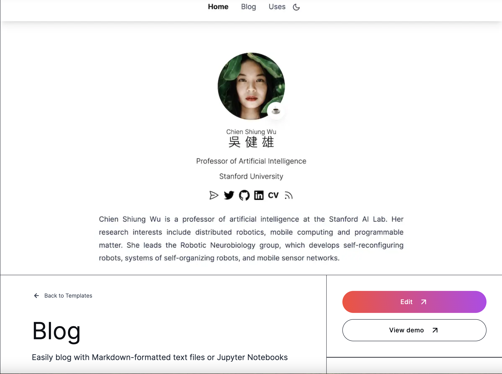
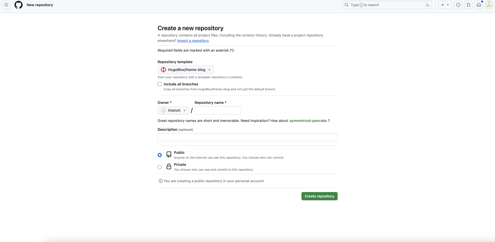
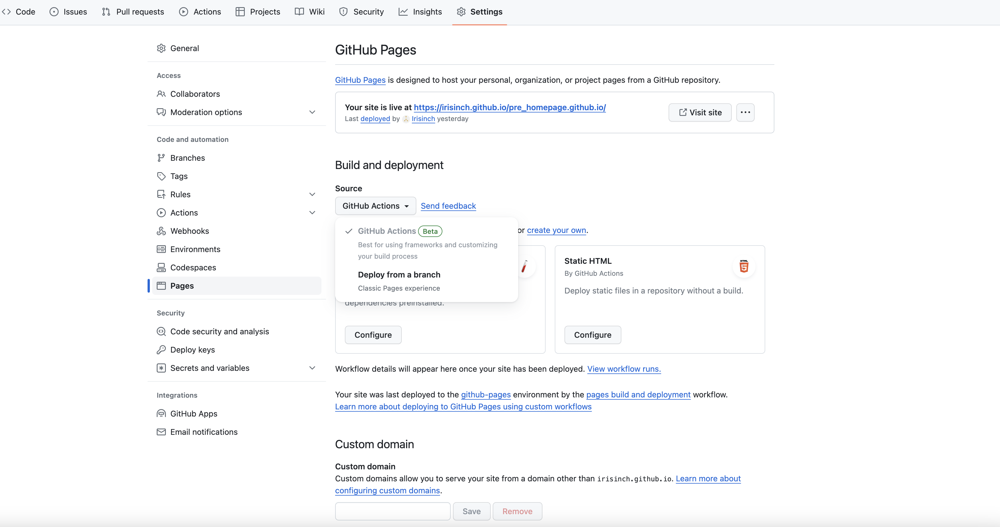
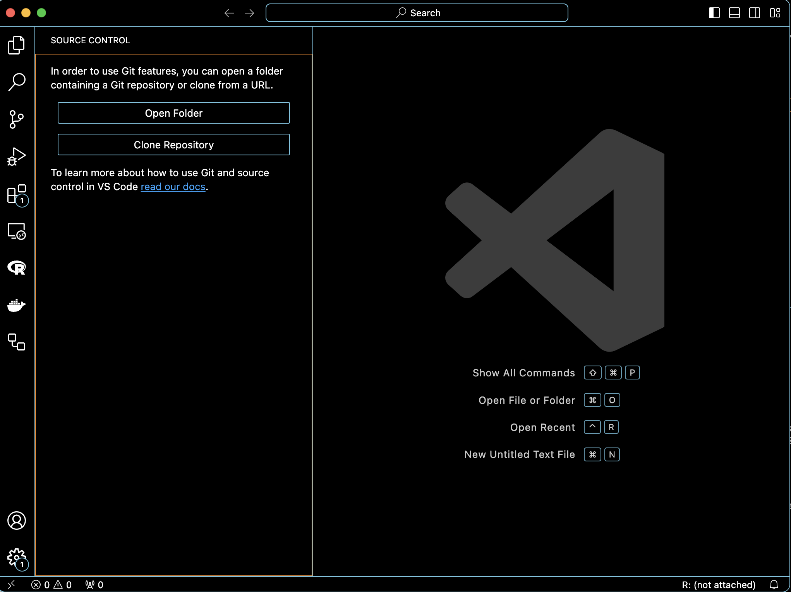

### はじめに
このページではHugoのテーマであるHugo bloxを使った個人サイトの作り方を紹介する。 
Hugoで個人サイトを作るときの大きな悩みどころの1つがどのテーマを用いるかである。 
テーマの人気ランキングを見るとよく目に入るのがAcademicであり、現在AcademicはHugo bloxに統合されている 
Hugo Bloxは（特にAcademicは）人気のテーマである一方で、作者のチュートリアルに従うと他と異なるステップで設定する必要がある。 
この記事では、Hugo Bloxの作者に従った方法でサイトを作成する。 
そのため、より汎用的なHugoの使い方が知りたいなら偉大な先輩の[Hugoの記事](https://ymat2.github.io/site/hugo.html)やMetalさんの[記事](https://heavywatal.github.io/misc/hugo.html)を参考にしていただきたい。  

### 事前準備
今回の方法では、事前にGitHubアカウントが必要になる。 
また、個人的にGithubアカウントと連携したVScodeの使用をお勧めする。  

### テーマ選び
Hugo Bloxの[テンプレート一覧](https://hugoblox.com/templates/)から好きなもの選ぶ。Proと付いているものは有料。 
[私のサイト](https://irisinch.github.io/ShinOno.github.io/)ではBlogを選んだ。 
ここから先は、Hugo Bloxの[tutorial](https://docs.hugoblox.com/tutorial/blog/)に従って進める。 
選んだテンプレートのEditを押すと、新しいレポジトリを作成する画面に移行する。
 
このとき、レポジトリの名前を**.github.ioにする。 
また、作成したレポジトリのSettings欄でPagesの設定を変更する必要がある。
 
ここで、Build and deploymentのSourceをGitHub Actionsに変更しておく。  

### トップページの編集
ここから先、tutorialでは、レポジトリのcodeボタンからCreate codespace on mainを選んで、編集していく。  
今回は、VScodeで進めていく。 
VScodeのSource Control欄、Clone Repository → GitHubから複製→ 作成したレポジトリを選択し、レポジトリを開く。
 
あとは、[tutorial](https://docs.hugoblox.com/)に従って編集するだけ。 

### 所感
Hugo Bloxテーマはtutorialやdocumentが充実している一方で、一般的なテーマと比べ不自由さも感じる。 
特に、、テーマの切り替えが手軽にできないのがHugoの良さを消してしまっている気がする。 
また、cssを使うことで構成をさらに変えることができるらしいので、チャレンジしたい。 
Hugo Bloxのいじる上で、山本さんのホームページが参考になったので紹介しておく。（[サイト](https://r9y9.github.io/)、[コード](https://github.com/r9y9/website/tree/master)）

